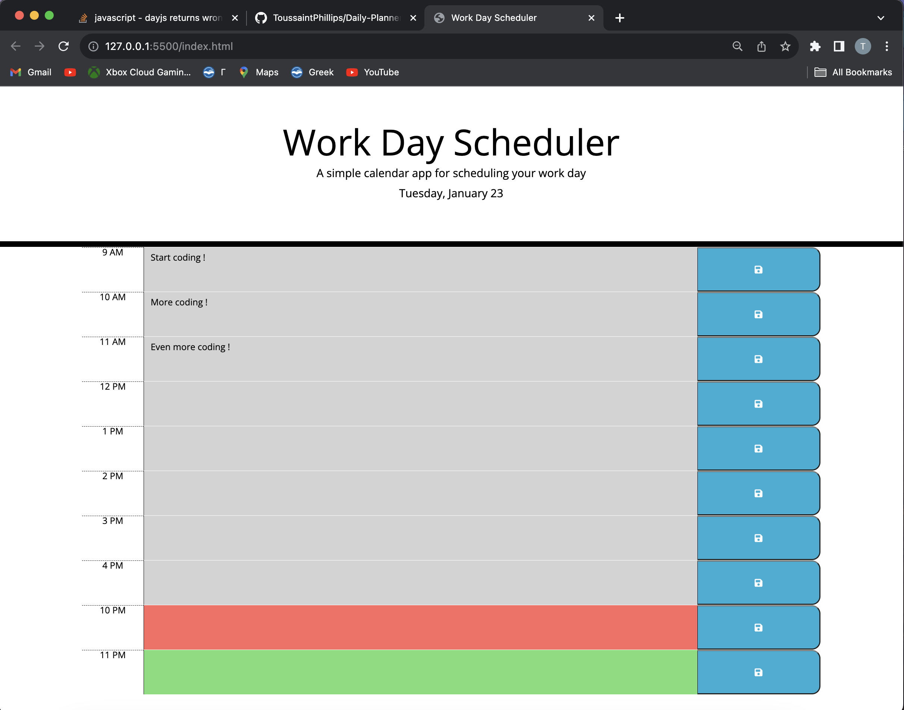
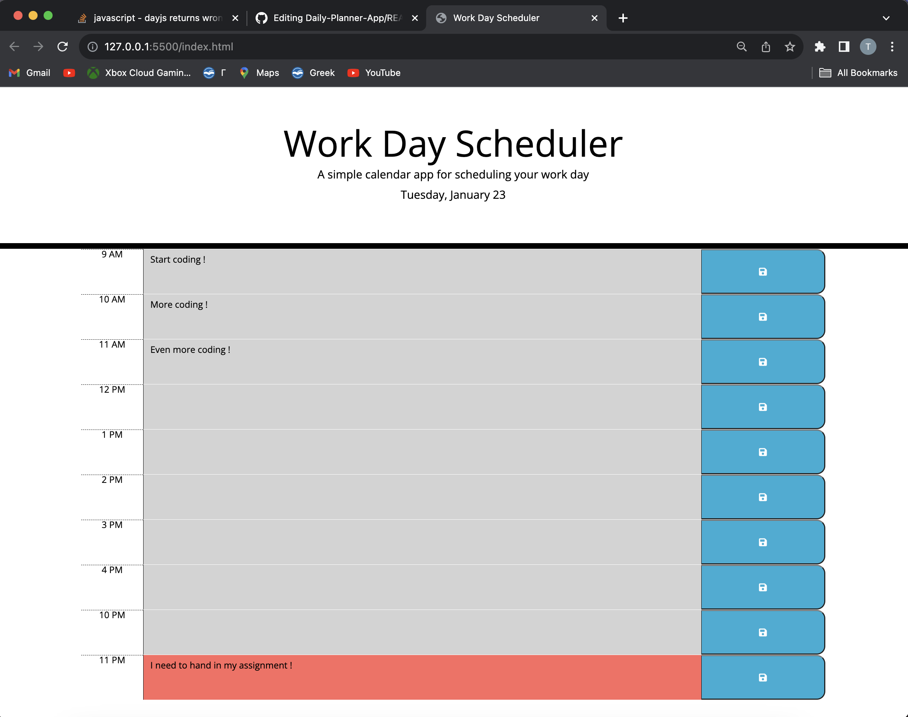

# Daily Planner App

A simple calendar application to help users efficiently manage their daily schedule. This app is designed for individuals with busy routines who want to organize their time effectively.

- [View on GitHub](https://github.com/ToussaintPhillips/Daily-Planner-App)
- [View Live Demo](https://toussaintphillips.github.io/Daily-Planner-App/)
- [Report Bug](https://github.com/ToussaintPhillips/Daily-Planner-App/issues)
- [Request Feature](https://github.com/ToussaintPhillips/Daily-Planner-App/issues)

## About The Project



### Features

- **Current Day Display**: The app prominently displays the current day at the top of the calendar for easy reference.

- **Timeblocks for Business Hours**: Timeblocks are provided for standard business hours to help users plan their day effectively.

- **Color-coded Timeblocks**: Timeblocks are color-coded to indicate whether they represent past, present, or future hours.

- **Event Entry**: Users can click on a timeblock to enter an event for that specific hour.

- **Save to Local Storage**: Events entered by the user are saved to local storage when the save button is clicked.

- **Persistence Between Refreshes**: The app ensures that events persist between page refreshes, providing continuity in the user's schedule.

## Usage

1. **Clone the Repository**:
    ```bash
    git clone https://github.com/ToussaintPhillips/Daily-Planner-App.git
    ```

2. **Navigate to the Project Directory**:
    ```bash
    cd Daily-Planner-App
    ```

3. **Open `index.html` in a Web Browser**: Launch the `index.html` file in your preferred web browser to start using the daily planner.

4. **View Current Day**: The current day is displayed at the top of the calendar.

5. **Enter Events**: Click on a timeblock to enter an event for that specific hour.

6. **Color-coded Timeblocks**: Easily identify past, present, and future hours based on color-coding.

7. **Save Events**: Click the save button in a timeblock to save the entered event to local storage.

8. **Persistence Between Refreshes**: Events persist between page refreshes, ensuring your schedule is always accessible.

## Screenshots



## Technologies

- HTML
- CSS
- JavaScript
- Day.js Library
- jQuery

## Contributing

Contributions are welcome! If you find any issues or have suggestions for improvement, please create a new issue or submit a pull request.

## Contact

For any inquiries or feedback, feel free to contact us:

- [Email](toussaintphillips@gmail.com)
- [LinkedIn](https://www.linkedin.com/in/toussaint-phillips/)

## License

Distributed under the MIT License. See `LICENSE` for more details.
